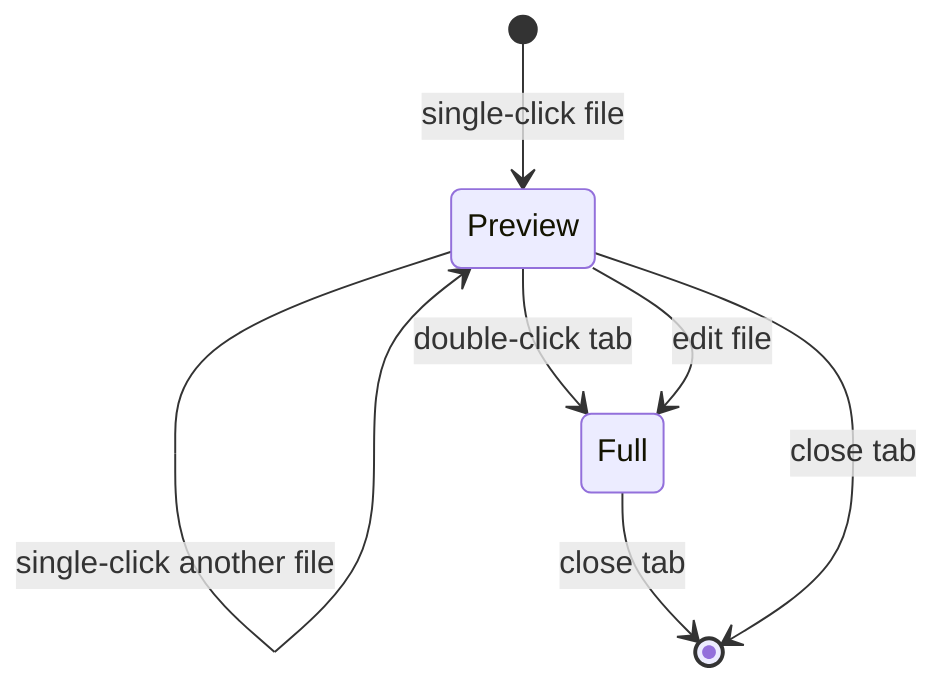

## Pattern

Editor tabs have two modes: **preview** (italic, dashed underline) and **full** (normal weight, persisted).

This mirrors VS Code's single-click / double-click behaviour.



## Rules

- **Preview tabs**: at most one at a time. Opening a new preview replaces the current one.
- **Full tabs**: accumulate. Multiple full tabs can be open simultaneously.
- **Promotion**: `promoteTab(id)` converts preview → full and enters edit mode.

## Implementation

```typescript
// In useEditorTabs — preview slot replacement
const existingPreviewIdx = prev.findIndex(t => t.isPreview);
if (existingPreviewIdx !== -1) {
  updated[existingPreviewIdx] = { id: path, path, isPreview: true, data: null };
  return updated;
}
```

The tab `id` equals the file `path` for file tabs, `diff:staged:path` for diff tabs, and `brain:entryId` for brain tabs.

## Why This Matters

Without this pattern, single-clicking through a file tree creates an unbounded list of open tabs. The preview slot acts as a cursor — it follows the user's exploration without cluttering the tab bar.
