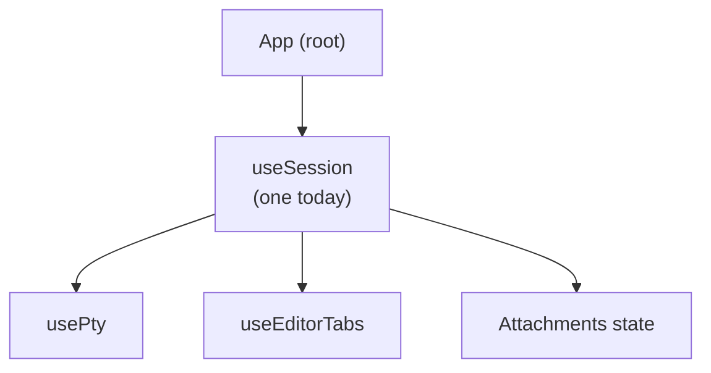

## Decision

One session per app instance today. When multi-session ships, `App` will map over an array of sessions — not restructure everything.

## Context

The original design considered one session per editor tab, letting users run multiple agents simultaneously in split panes. This was rejected for v1 because:

- **Complexity**: routing PTY data to the correct terminal requires non-trivial multiplexing
- **UX confusion**: which terminal is "active" for keyboard input becomes ambiguous
- **State explosion**: each session owns PTY + editor tabs + attachments — tripling state surface area

## Chosen Approach

`useSession` is the **seam** — App treats it as an opaque unit. When multi-session lands, App renders `sessions.map(s => <SessionPane session={s} />)` with minimal changes to child components.

## Trade-offs

| Single session | Multi-session (future) |
|---|---|
| Simple state | Array of sessions |
| One terminal focus | Focus management needed |
| Ships fast | More user value |

## Status

Accepted for v1. Multi-session is documented in `CONTEXT.md` as a known future expansion.
