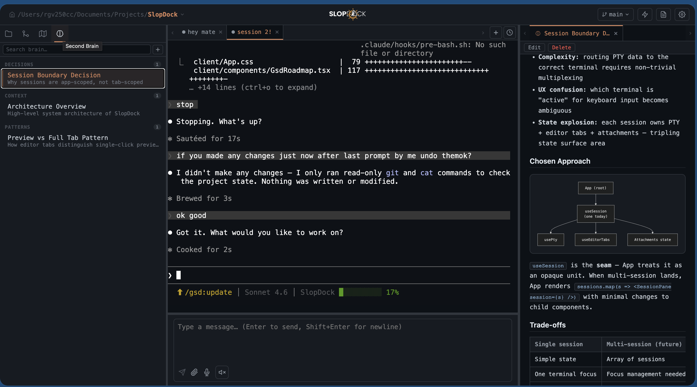
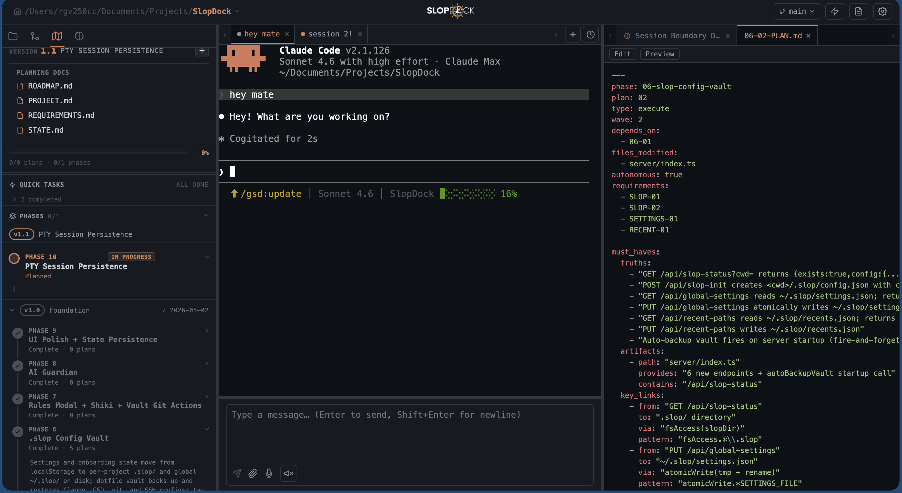
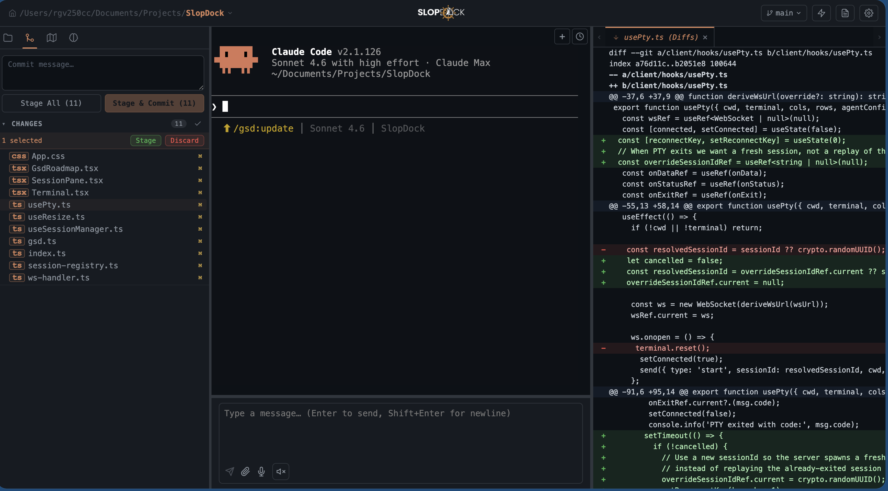
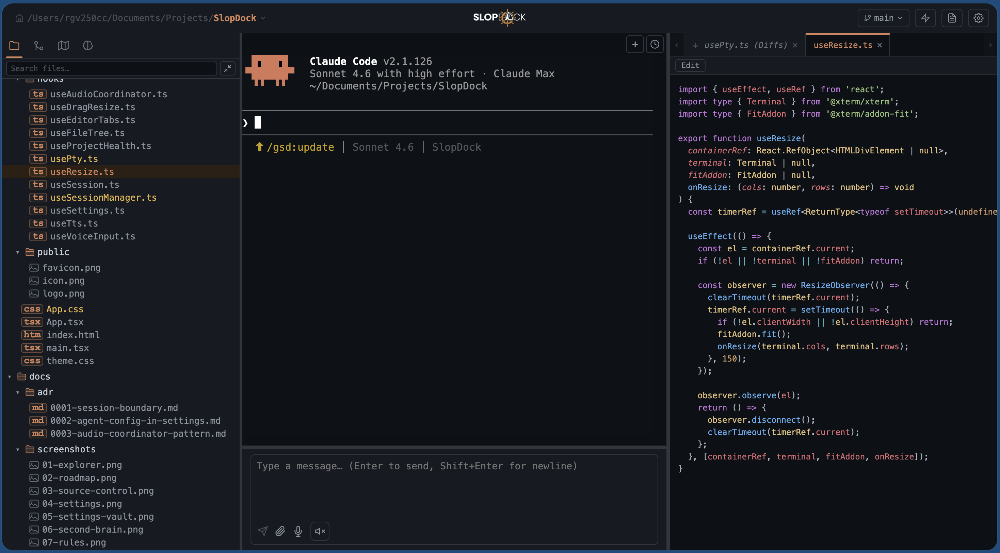
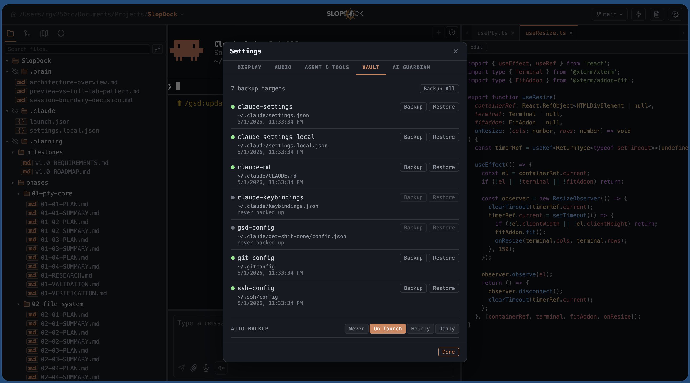
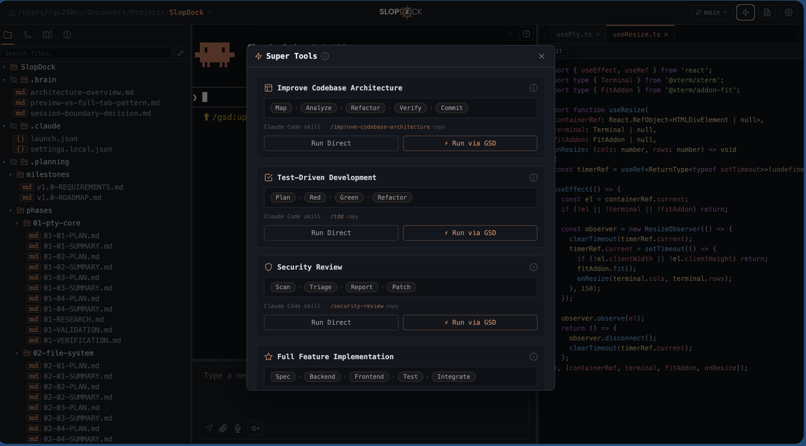

<div align="center">

# SlopDock

**Your entire AI dev workflow. One browser tab.**

[](LICENSE)
[](https://nodejs.org)
[](https://www.typescriptlang.org)
[](https://react.dev)

SlopDock is a local browser workspace that wraps Claude Code (or any AI CLI) with everything you actually need every day — terminal, file explorer, git diff viewer, voice I/O, GSD roadmap tracker, skills launcher, vault backup, and a second brain — in a single lightweight app that runs entirely on your machine.

**Open browser → select folder → start coding.** No install wizard. No cloud. No telemetry. You own everything.

</div>

---

## The problem it solves

A typical AI coding session today looks like this: terminal open for the agent, VS Code open for the files, a git GUI for staging, a browser for docs, a notes app for context. You're context-switching constantly just to track what's happening.

SlopDock collapses that entirely. Every tool you reach for is a panel click away — and it's designed around the actual workflow, not just the terminal:

- **Source control** is live in the sidebar. Stage, diff, and commit without touching another app.
- **The file tree** reflects exactly what the agent is reading and writing, in real time.
- **Voice mode** means you can speak your next prompt and hear the response read back — hands-free while the agent works.
- **GSD roadmap** keeps the plan visible. You always know which phase you're in and what's left.
- **Skills launcher** surfaces Claude Code shortcuts you'd otherwise forget — one click to run them.
- **Second Brain** keeps project-specific knowledge attached to the workspace, not lost in a notes file somewhere.
- **Vault** backs up your Claude settings, git config, and SSH config automatically — portable across machines.

If you have access to a remote machine via VPN, open SlopDock in a browser and develop there without installing anything locally. Your subscription CLI is yours; everything else is offline and free.

---

## Screenshots

### Active session with Second Brain research panel



*A live Claude Code session on the left. The Second Brain panel on the right surfaces per-project decisions and architectural notes while the agent works.*

---

### GSD Roadmap + Plan viewer



*The roadmap panel renders `.planning/` inline — phases, plans, progress, quick tasks. The right pane previews the active plan file with full markdown rendering. No context switching.*

---

### Source control — full diff viewer



*Every changed file listed with per-file stage/unstage/discard controls. The diff viewer shows exactly what the agent wrote. Review before you commit, right in the browser.*

---

### File explorer + syntax-highlighted editor



*Collapsible tree, file type icons, fuzzy search. The editor opens any file with full syntax highlighting. Preview tabs promote to permanent on first edit — familiar VS Code behavior.*

---

### Vault — dotfile backup and restore



*One-click backup and restore for Claude settings, GSD config, git config, and SSH config. Timestamped snapshots, auto-schedule, optional git remote for cross-machine sync.*

---

### Super Tools — skills launcher



*A curated palette of Claude Code skills — Improve Codebase Architecture, Test-Driven Development, Security Review, Full Feature Implementation — available in one click. Skills you'd otherwise have to remember to type are always visible.*

---

## Features

### Terminal
- **Full PTY fidelity** — real pseudo-terminal via node-pty. ANSI color, interactive prompts, resize, scroll, keyboard shortcuts all work exactly as in a native terminal
- **Multiple sessions per workspace** — open separate tabs for separate contexts; each gets its own PTY, editor tabs, and attachments. Live status indicators show working / waiting / done at a glance
- **Session persistence** — reload the browser and your session reconnects; the PTY keeps running in the background
- **Any CLI agent** — Claude Code, Aider, OpenCode, Goose, Gemini CLI, Codex, Hermes. Auto-detected from PATH; configure command and args in Settings

### File management
- **File explorer** — collapsible tree, per-type icons, fuzzy search, hidden-file toggle, inline new file / new folder actions
- **Syntax-highlighted editor** — view and edit any file using Shiki (`one-dark-pro` theme). Preview tabs promote to permanent on first edit
- **File sharing with the agent** — attach any file to the active session. The agent receives it as context without you having to type a path

### Git integration
- **Staged / unstaged diff viewer** — full unified diff per file, color-coded additions and deletions
- **Per-file controls** — stage, unstage, or discard individual files from the UI
- **Branch switcher and push** — change branches and push without leaving the app
- **Commit from the sidebar** — write a message and commit staged changes directly

### Voice
- **Voice input (STT)** — push-to-talk or toggle mode. Audio transcribed locally by [Whisper](https://github.com/openai/whisper). Configurable hotkey
- **Voice output (TTS)** — Claude's terminal output read aloud sentence-by-sentence via local [Piper](https://github.com/rhasspy/piper). Pause or stop at any time
- **Mutual exclusion** — TTS auto-pauses when recording starts; an active recording cancels TTS. No accidental overlap

### Planning and knowledge
- **GSD roadmap panel** — renders `.planning/ROADMAP.md` inline: phases, plans, progress bar, quick tasks, planning doc links. Inline removal of phases and plans without opening a terminal
- **Second Brain panel** — per-workspace knowledge base stored as frontmatter Markdown in `.brain/`. Architectural decisions, pitfalls, and context stay attached to the project
- **AI Guardian** — per-project toggle that enforces roadmap alignment: flags unplanned work, phase-skip warnings, and prompts to capture knowledge back to the second brain after non-trivial sessions

### Skills and tooling
- **Super Tools launcher** — a modal palette of available Claude Code skills with single-click invocation. Surfaces capabilities that would otherwise be forgotten or under-used: architecture review, TDD, security review, full-feature implementation, and more
- **Skills run via GSD or direct** — each tool shows both a "Run Direct" and "Run via GSD" option. Choose the structured path or the fast path per task

### Workspace and config
- **Workspace-scoped configuration** — each folder you open can have its own `.slop/` directory with a `config.json` and `ai-guardian.md`. Different projects get different rules and agent instructions automatically
- **Vault backup** — timestamped snapshots of `~/.claude/settings.json`, `CLAUDE.md`, `keybindings.json`, `~/.gitconfig`, and `~/.ssh/config`. Auto-schedule (on launch / hourly / daily) and optional git-backed remote sync for cross-machine portability
- **Drag-resizable panels** — sidebar, terminal, and preview widths adjustable and persisted per workspace
- **Health check bar** — surfaces missing git, CLAUDE.md, agent CLI, or node_modules at a glance on first open

### Access and portability
- **Pure browser UI** — open `http://localhost:5173`, pick a folder, start a session. No Electron, no native app install
- **Multiple tabs / windows** — one tab per project, or one window per machine. No coupling between sessions
- **Remote development via VPN** — run SlopDock on a remote machine and access it through a browser over VPN. Nothing installed locally except the browser
- **Your subscription, your keys** — SlopDock wraps your own Claude Code CLI. It never touches your credentials and has no telemetry or cloud component
- **Fully offline** — all features except the agent CLI itself run without an internet connection
- **Extensible** — the architecture is intentionally simple (Express + React, ~40 HTTP routes, plain CSS). Adding a new panel, tool, or integration is a few files

---

## Quick start

**One-liner** — clones the repo, checks dependencies, and starts the server:

```bash
curl -fsSL https://raw.githubusercontent.com/rg1989/SlopDock/main/scripts/install.sh | bash
```

**Manual install:**

```bash
npm install
npm run setup    # verifies Node, Claude CLI, GSD; installs what's missing
npm run dev
```

Open [http://localhost:5173](http://localhost:5173), pick a workspace folder, and start a session.

`npm run setup` is idempotent — safe to re-run. It never downgrades or resets an existing install.

---

## Requirements

| Requirement | Notes |
|---|---|
| **Node.js 20+** | Backend PTY server |
| **macOS** | Primary platform; Linux likely works; Windows not supported |
| **Claude Code** (or another agent CLI) in `PATH` | `claude`, `aider`, `opencode`, `goose`, etc. |
| **[Piper TTS](https://github.com/rhasspy/piper)** *(optional)* | Enables voice output |
| **[Whisper](https://github.com/openai/whisper)** *(optional)* | Enables voice input (`pip install openai-whisper` + `brew install ffmpeg`) |

---

## Voice setup

Voice features are optional and disabled gracefully if dependencies are absent.

**Whisper STT** (voice input):
```bash
pip install openai-whisper
brew install ffmpeg
```

**Piper TTS** (voice output): download a pre-built binary and voice model from the [Piper releases page](https://github.com/rhasspy/piper/releases). Place the `piper` binary in `PATH` and set the voice model path in **Settings → Audio**.

SlopDock reports setup status in the voice bar at the bottom of the terminal area.

---

## GSD integration

If your workspace has a `.planning/` directory created by [GSD](https://github.com/gsd-build/gsd-2), the roadmap panel renders it live:

- **Progress bar** — milestone completion (plans done / total)
- **Phase list** — each phase with status, plan count, and inline expand
- **Quick tasks** — ad-hoc tasks from `STATE.md` with completion checkboxes
- **Planning doc links** — direct links to `ROADMAP.md`, `PROJECT.md`, `REQUIREMENTS.md`, `STATE.md`
- **Inline removal** — delete phases or plans from the UI without opening a terminal

The GSD panel is read-only by default; writes go through the GSD CLI in the terminal session.

---

## Project structure

```
slopdock/
├── client/                   # React 19 + Vite frontend
│   ├── components/           # All UI components
│   ├── hooks/                # Custom React hooks
│   ├── App.tsx               # Root layout and wiring
│   └── theme.css             # Single-source color palette (CSS custom properties)
├── server/                   # Express + node-pty backend
│   ├── index.ts              # HTTP API endpoints (~40 routes)
│   ├── ws-handler.ts         # WebSocket PTY handler
│   ├── gsd.ts                # GSD roadmap parser (pure functions)
│   ├── file-api.ts           # File tree + git helpers
│   ├── piper-tts.ts          # Local Piper TTS integration
│   └── whisper-stt.ts        # Local Whisper STT integration
├── shared/
│   └── protocol.ts           # WebSocket message types
├── tests/                    # Vitest unit tests
├── docs/
│   ├── adr/                  # Architecture Decision Records
│   └── screenshots/          # App screenshots for documentation
└── scripts/
    ├── setup.sh              # Idempotent dependency check + install
    └── install.sh            # One-liner bootstrap for new installs
```

---

## Scripts

| Command | What it does |
|---|---|
| `npm run setup` | Check and install dependencies (Node, Claude CLI, GSD, voice tools) |
| `npm run dev` | Start Express server + Vite dev server concurrently |
| `npm run build` | TypeScript compile + Vite production build |
| `npm test` | Run unit tests with Vitest |
| `npm run update-vendor` | Pull latest `gsd-pi` from npm and refresh `vendor/` |

---

## Configuration

Settings are accessible via the gear icon in the top-right corner.

### Display
| Setting | Options |
|---|---|
| Hidden files | Show / Hide |
| Sidebar tabs | Horizontal / Vertical |
| Type icon size | 14 / 11 / 9 / None |

### Audio
| Setting | Description |
|---|---|
| PTT key | Configurable keyboard shortcut for push-to-talk |
| Recording mode | Hold (while key held) / Toggle (one press on, one press off) |

### Agent & Tools
Configure which CLI agent to spawn. SlopDock auto-detects installed agents (`claude`, `opencode`, `aider`, `gemini`, `codex`, `hermes`, `goose`) and lists available ones in a dropdown. Each entry has a **command**, optional **args**, and a **label** shown in the UI.

### Vault
Backs up dotfiles to `~/.slop/backups/` on a configurable schedule (never / on launch / hourly / daily). Vault data can be synced to a private git remote for cross-machine portability.

| File | Description |
|---|---|
| `~/.claude/settings.json` | Claude Code settings |
| `~/.claude/CLAUDE.md` | Global Claude instructions |
| `~/.claude/keybindings.json` | Key bindings |
| `~/.gitconfig` | Git config |
| `~/.ssh/config` | SSH config |

### AI Guardian
Per-project toggle that enables roadmap alignment rules from `.slop/ai-guardian.md`. Surfaces unplanned work, phase-skip warnings, and prompts to capture knowledge to the second brain after non-trivial sessions.

---

## Architecture

SlopDock is a local web app with two processes connected through a WebSocket:

```
Browser (React + xterm.js)
  │
  │  HTTP  ──►  Express server  ──►  node-pty  ──►  Agent CLI (claude / aider / …)
  │
  └─ WS   ─────────────────────────────────────────► PTY stdin/stdout
```

**Key design decisions:**

- **Session boundary** — the PTY connection, open editor tabs, and staged attachments are all grouped into a single `useSession` hook. Session state is scoped and self-contained; workspace-level state (file tree, roadmap, source control) lives in `App`. See [ADR-0001](docs/adr/0001-session-boundary.md).

- **Agent configuration in settings** — the agent command and args live in user settings, not per-workspace config files. A workspace-level override can be added when the need arises. See [ADR-0002](docs/adr/0002-agent-config-in-settings.md).

- **Audio coordination** — TTS and STT are mutually exclusive. The `AudioCoordinator` hook owns both and enforces no overlap. See [ADR-0003](docs/adr/0003-audio-coordinator-pattern.md).

- **No CSS-in-JS, no component libraries** — plain CSS in `client/App.css` with a single-source color palette in `client/theme.css`. All palette values are CSS custom properties; raw hex values are banned from component code.

---

## Contributing

See [docs/CONTRIBUTING.md](docs/CONTRIBUTING.md) for the full guide. The short version:

1. Fork and clone the repo
2. `npm install && npm run setup`
3. Create a feature branch
4. Make your changes with tests where appropriate (`npm test`)
5. Open a pull request

No large dependencies without discussion — the bundle is intentionally lean. Adding a new panel or tool should touch a handful of files, not require a new library.

---

## License

[MIT](LICENSE) — Roman Grinevic
